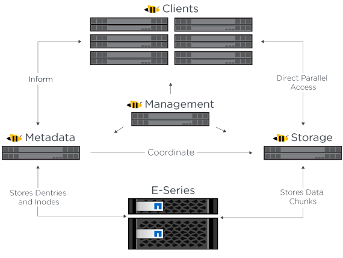
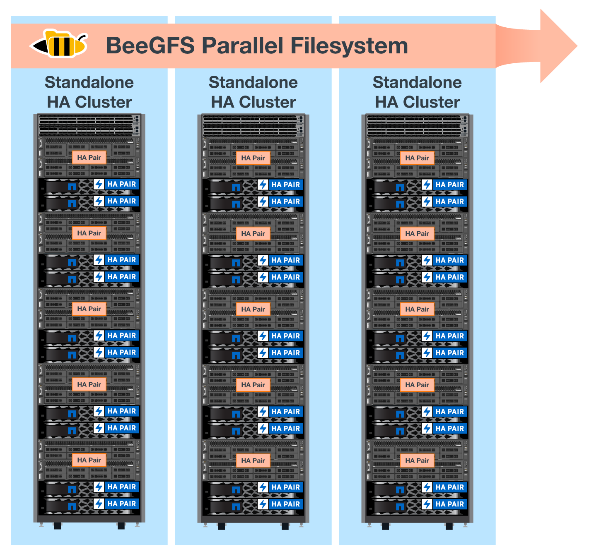

= Architecture overview
:hardbreaks:
:nofooter:
:icons: font
:linkattrs:
:imagesdir: ./media/

[.lead]
The BeeGFS on NetApp solution includes architectural design considerations used to determine the specific equipment, cabling, and configurations required to support validated workloads.

== Building block architecture
A BeeGFS file system can be deployed and scaled out in different ways depending on the storage requirements. For example, use cases primarily featuring numerous small files will benefit from extra metadata performance and capacity, whereas use cases featuring fewer larger files might favor more storage capacity and performance for actual file contents. These multiple considerations impact different dimensions of the parallel file system deployment, which adds complexity to designing and deploying the file system.

To address these challenges, NetApp has designed a standard building block architecture that is used to scale out each of these dimensions. Typically, BeeGFS building blocks are deployed in one of three configuration profiles:

* A single base building block, including BeeGFS management, metadata, and storage services
* A BeeGFS metadata plus storage building block
* A BeeGFS storage only building block

The only (optional) hardware change between these three options is the use of smaller drives for BeeGFS metadata. Otherwise, all configuration changes are applied through software, and the use of Ansible as the deployment engine makes it straightforward to set the profile desired for a particular building block.

For further details, see <<Verified hardware design>>.

== File system services

The BeeGFS file system includes the following main services:

* *Management service.* Registers and monitors all other services.
* *Storage service.* Stores the distributed user file contents known as data chunk files.
* *Metadata service.* Keeps track of the file system layout, directory, and file attributes, and so on.
* *Client service.* Mounts the file system to access the stored data.

The following figure shows BeeGFS solution components and relationships used with NetApp E-Series systems.

As a parallel file system, BeeGFS stripes its files over multiple server nodes to maximize read/write performance and scalability. The server nodes work together to deliver a single file system that can be simultaneously mounted and accessed by other server nodes, commonly known as _clients_. These clients can see and consume the distributed file system similarly to a local file system such as NTFS, XFS, or ext4.

The four main services run on a wide range of supported Linux distributions and communicate via any TCP/IP or RDMA-capable network, including InfiniBand (IB), Omni-Path (OPA), and RDMA over Converged Ethernet (RoCE). The BeeGFS server (management, storage, and metadata) services are user space daemons, while the client is a native kernel module (patchless). All components can be installed or updated without rebooting, and you can run any combination of services on the same node.

== Verified nodes

The BeeGFS on NetApp solution includes the following verified nodes: the NetApp EF600 storage system (block node) and the Lenovo ThinkSystem SR665 Server (file node).

=== Block node: EF600 storage system

The NetApp EF600 all-flash storage ThinkSystem provides consistent, near-real-time access to data while supporting any number of workloads simultaneously. To enable fast, continuous feeding of data to AI and HPC applications, EF600 storage systems deliver up to two million cached read IOPS, response times of under 100 microseconds, and 42GBps sequential read bandwidth in one enclosure. With 99.9999% reliability from EF600 storage systems, data for AI and HPC operations is available whenever and wherever it is needed.

=== File node: Lenovo ThinkSystem SR665 Server

The SR665 is a two-socket 2U server featuring PCIe 4.0. When configured to meet the requirements of this solution, it provides ample performance to run BeeGFS file services in a configuration well balanced with the available of throughput and IOPs provided by the direct attached E-Series nodes.

For more information about the Lenovo SR665, see https://lenovopress.com/lp1269-thinksystem-sr665-server[Lenovo’s website^].

== Verified hardware design

The solution's building blocks (shown in the following figure) uses two dual socket PCIe 4.0-capable servers for the BeeGFS file layer and two EF600 storage systems as the block layer.

image:../media/beegfs-design-image2.png[]

[NOTE]
Because each building block includes two BeeGFS file nodes, a minimum of two building blocks is required to establish quorum in the failover cluster. While you can configure a two-node cluster, this configuration has limits that might prevent a successful failover to occur. If you require a two-node cluster, you can incorporate a third device as a tiebreaker (however, that design is not covered in this site).

Each building block delivers high availability through a two-tier hardware design that separates fault domains for the file and block layers. Each tier can independently fail over providing increased resiliency and reducing the risk of cascading failures. Using HDR InfiniBand in conjunction with NVMeOF provides high throughput and minimal latency between file and block nodes, with full redundancy and sufficient link oversubscription to avoid the disaggregated design becoming a bottleneck, even when the system is partially degraded.

The BeeGFS on NetApp solution runs across all building blocks in the deployment. The first building block deployed must run BeeGFS management, metadata, and storage services (referred to as the base building block). All subsequent building blocks are configured through software to run BeeGFS metadata and storage services, or only storage services. The availability of different configuration profiles for each building block enables scaling of file system metadata or storage capacity and performance using the same underlying hardware platforms and building block design.

Up to five building blocks are combined into a standalone Linux HA cluster, ensuring a reasonable number of resources per cluster resource manager (Pacemaker), and reducing the messaging overhead required to keep cluster members in sync (Corosync). A minimum of two building blocks per cluster is recommended to allow enough members to establish quorum. One or more of these standalone BeeGFS HA clusters are combined to create a BeeGFS file system (shown in the following figure) that is accessible to clients as a single storage namespace.

Although ultimately the number of building blocks per rack depends on the power and cooling requirements for a given site, the solution was designed so that up to five building blocks can deployed in a single 42U rack while still providing room for two 1U InfiniBand switches used for the storage/data network.  Each building block requires eight IB ports (four per switch for redundancy), so five building blocks leaves half the ports on a 40-port HDR InfiniBand switch (like the NVIDIA QM8700) available to implement a fat-tree or similar nonblocking topology. This configuration ensures that the number storage or compute/GPU racks can be scaled up without networking bottlenecks. Optionally, an oversubscribed storage fabric can be used at the recommendation of the storage fabric vendor.

The following image shows an 80-node fat-tree topology.

image:../media/beegfs-design-image4.png[]

== Ansible

BeeGFS on NetApp is delivered and deployed using Ansible automation hosted on https://github.com/netappeseries/beegfs/[GitHub^] and https://galaxy.ansible.com/netapp_eseries/beegfs[Ansible Galaxy^] (see the  <<xref>> section for more details). Although Ansible is primarily tested with the hardware used to assemble the BeeGFS building blocks, you can configure it to run on virtually any x86 based server using a supported Linux distribution.

By using Ansible as the deployment engine to deploy BeeGFS on NetApp, the entire environment is maintained using https://www.netapp.com/blog/deploying-beegfs-eseries/[modern infrastructure as code^] practices. This drastically simplifies what would otherwise be a complex system of systems, allowing administrators to define and adjust configuration all in one place and then verify that it is applied consistently regardless of how large the environment scales.
