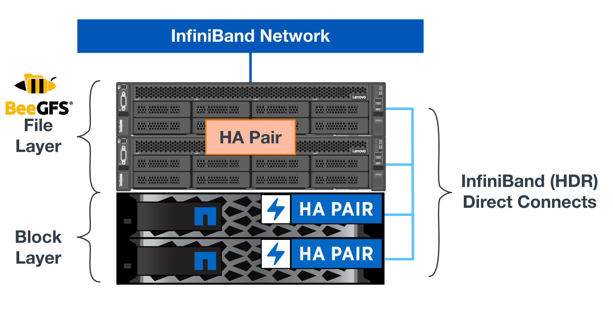

= Architecture overview
:hardbreaks:
:nofooter:
:icons: font
:linkattrs:
:imagesdir: ./media/

[.lead]
The BeeGFS on NetApp solution includes architectural design considerations used to determine the specific equipment, cabling, and configurations required to support the validated workload.

== Verified nodes

The BeeGFS on NetApp solution includes the following verified nodes: the NetApp EF600 storage system (block node) and the Lenovo ThinkSystem SR665 Server (file node).

=== Verified block node: EF600

The NetApp EF600 all-flash array provides consistent, near-real-time access to data while supporting any number of workloads simultaneously. To enable fast, continuous feeding of data to AI and HPC applications, EF600 storage systems deliver up to two million cached read IOPS, response times of under 100 microseconds, and 42GBps sequential read bandwidth in one enclosure. With 99.9999% reliability from EF600 storage systems, data for AI and HPC operations is available whenever and wherever it is needed.

=== Verified file node: Lenovo ThinkSystem SR665 Server

The SR665 is a two-socket 2U server featuring PCIe 4.0. When configured to meet the requirements of this NetApp Verified Architecture, it provides ample performance to run BeeGFS file services in a configuration well balanced with the available of throughput and IOPs provided by the direct attached E-Series nodes.

For more information about the Lenovo SR665, see https://lenovopress.com/lp1269-thinksystem-sr665-server[Lenovo’s website^].

== Verified hardware design

The NetApp BeeGFS building block (shown in the following figure) uses two dual socket PCIe 4.0-capable servers for the BeeGFS file layer and two NetApp EF600 storage systems as the block layer.

These 8U building blocks more than double the performance of the https://www.netapp.com/pdf.html?item=/media/25445-nva-1156-design.pdf[NetApp first-generation BeeGFS building block^] design while adding support for high availability. Multiple building blocks are combined to create a BeeGFS parallel file system, which can span multiple datacenter racks if necessary. These building blocks are the hardware aspect of this NetApp Verified Architecture.

[NOTE]
Because each building block includes two BeeGFS file nodes, a minimum of two building blocks is required to establish quorum in the failover cluster. While it is possible to configure a two-node cluster, there are limitations to this configuration that might prevent a successful failover to occur in some scenarios.  If a two-node cluster is required,  it is also possible to incorporate a third device as a tiebreaker,  although that is not described in this design guide.

Each building block delivers high availability through a two-tier hardware design that separates fault domains for the file and block layers. Each tier can independently fail over providing increased resiliency and reducing the risk of cascading failures. The use of HDR InfiniBand in conjunction with NVMeOF provides high throughput and minimal latency between file and block nodes, with full redundancy and sufficient link oversubscription to avoid the disaggregated design becoming a bottleneck, even when the system is partially degraded.

The NetApp software-defined BeeGFS solution runs across all building blocks in the deployment. The first building block deployed must run BeeGFS management, metadata, and storage services (referred to as the base building block). All subsequent building blocks are configured through software to run BeeGFS metadata and storage services, or only storage services. The availability of different configuration profiles for each building block enables scaling of file system metadata or storage capacity and performance using the same underlying hardware platforms and building block design.

Up to five building blocks are combined into a standalone Linux HA cluster, ensuring a reasonable number of resources per cluster resource manager (Pacemaker),  and reducing the messaging overhead required to keep cluster members in sync (Corosync). A minimum of two building blocks per cluster is recommended to allow enough members to establish quorum. One or more of these standalone BeeGFS HA clusters are combined to create a BeeGFS file system (shown in the following figure) that is accessible to clients as a single storage namespace.

image:../media/beegfs-design-image3.png[]

Although ultimately the number of building blocks per rack depends on the power and cooling requirements for a given site, the solution was designed so that up to five building blocks can deployed in a single 42U rack while still providing room for two 1U InfiniBand switches used for the storage/data network.  Each building block requires eight IB ports (four per switch for redundancy),  so five building blocks leaves half the ports on a 40- port HDR InfiniBand switch (like the NVIDIA QM8700) available to implement a fat-tree or similar nonblocking topology. This configuration ensures that the number storage or compute/GPU racks can be scaled up without worrying about networking bottlenecks.  Optionally,  an oversubscribed storage fabric can be used at the recommendation of the storage fabric vendor.

The following image shows an 80-node fat-tree topology.

image:../media/beegfs-design-image4.png[]

By using Ansible as the deployment engine to deploy BeeGFS on NetApp, the entire environment is maintained using https://www.netapp.com/blog/deploying-beegfs-eseries/[modern infrastructure as code^] practices. This drastically simplifies what would otherwise be a complex system of systems, allowing administrators to define and adjust configuration all in one place and then verify that it is applied consistently regardless of how large the environment scales.
