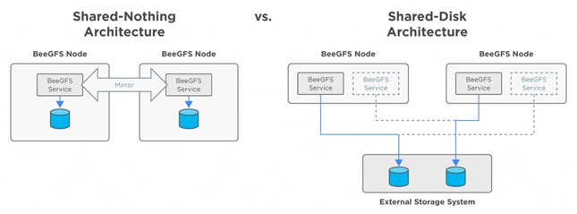

= Solution overview
:hardbreaks:
:nofooter:
:icons: font
:linkattrs:
:imagesdir: ./media/

[.lead]
The BeeGFS on NetApp solution combines the BeeGFS parallel file system with NetApp EF600 storage systems for a reliable, scalable, and cost-effective infrastructure that keeps pace with demanding workloads.

This design takes advantage of the performance density delivered by the latest enterprise server and storage hardware and network speeds, requiring file nodes that feature dual AMD EPYC 7003 “Milan” processors and support for PCIe 4.0 with direct connects using 200Gb (HDR) InfiniBand to block nodes that provide end-to-end NVMe and NVMeOF using the NVMe/IB protocol.

== NetApp Verified Architecture (NVA) program

The BeeGFS on NetApp solution is part of the NVA program, which provides customers with reference configurations and sizing guidance for specific workloads and use cases. NVA solutions are thoroughly tested and designed to minimize deployment risks and to accelerate time to market.

== Use cases
The following use cases apply to the BeeGFS on NetApp solution:

* Artificial Intelligence (AI) including machine learning (ML), deep learning (DL), large-scale natural language processing (NLP), and natural language understanding (NLU). For more information, see https://www.netapp.com/blog/beefs-for-ai-fact-vs-fiction/[BeeGFS for AI: Fact versus fiction^].
* High-performance computing (HPC) including applications accelerated by MPI //message passing interface?// and other distributed computing techniques. For more information, see https://www.netapp.com/blog/beegfs-for-ai-ml-dl/[Why BeeGFS goes beyond HPC^].
* Application workloads characterized by:
** Reading or writing to files larger than 1GB
** Reading or writing to the same file by multiple clients (10s, 100s, and 1000s)
* Multi-terabyte or multi-petabyte datasets.
* Environments that need a single storage namespace optimizable for a mix of large and small files.

== Benefits
The key benefits of using BeeGFS on NetApp include:

* Availability of verified hardware designs providing full integration of hardware and software components to ensure predicable performance and reliability.
* Deployed and managed using Ansible for simplicity and consistency at scale.
* Monitoring and observability provided using the E-Series Performance Analyzer and BeeGFS plugin. For more information, see https://www.netapp.com/blog/monitoring-netapp-eseries/[Introducing a Framework to Monitor NetApp E-Series Solutions^].
* High availability featuring a shared-disk architecture that provides data durability and availability.
* Support for modern workload management and orchestration using containers and Kubernetes. For more information, see https://www.netapp.com/blog/kubernetes-meet-beegfs/[Kubernetes meet BeeGFS: A tale of future-proof investment^].

== HA architecture

BeeGFS on NetApp expands the functionality of the BeeGFS enterprise edition by creating a fully integrated solution with NetApp hardware that enables a shared-disk high availability (HA) architecture.

NOTE: While the BeeGFS community edition can be used free of charge, the enterprise edition requires purchasing a professional support subscription contract from a partner like NetApp. The enterprise edition allows use of several additional features including resiliency, quota enforcement, and storage pools.

The following figure compares the shared-nothing and shared-disk high availability (HA) architectures.

For more information, see https://www.netapp.com/blog/high-availability-beegfs/[Announcing High Availability for BeeGFS Supported by NetApp^].

== Ansible

BeeGFS on NetApp is delivered and deployed using Ansible automation hosted on GitHub and Ansible Galaxy (the BeeGFS collection is available from https://galaxy.ansible.com/netapp_eseries/beegfs[Ansible Galaxy^] and https://github.com/netappeseries/beegfs/[NetApp's E-Series GitHub^]). Although Ansible is primarily tested with the hardware used to assemble the BeeGFS building blocks, you can configure it to run on virtually any x86 based server using a supported Linux distribution.

For more information, see https://www.netapp.com/blog/deploying-beegfs-eseries/[Deploying BeeGFS with E-Series Storage^].
