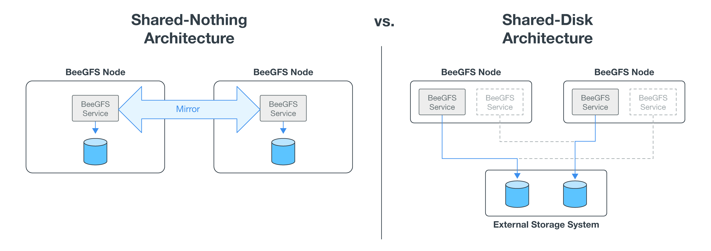

= BeeGFS on NetApp solution overview
:hardbreaks:
:nofooter:
:icons: font
:linkattrs:
:imagesdir: ./media/

[.lead]
_Rework in progress; trim down marketing language_

While the community edition of BeeGFS can be used free of charge, the enterprise edition requires purchasing a professional support subscription contract from a partner like NetApp. The enterprise edition allows use of several additional features including resiliency, quota enforcement, and storage pools.

The BeeGFS on NetApp solution expands the functionality of the BeeGFS enterprise edition by creating a fully integrated solution with NetApp hardware and enabling high availability based on NetApp E-Series and EF-Series storage systems using a shared-disk HA architecture.

The following figure compares the shared-nothing and shared-disk HA architectures.

BeeGFS on NetApp is delivered and deployed using Ansible automation hosted on https://github.com/netappeseries/beegfs/[GitHub^] and https://galaxy.ansible.com/netapp_eseries/beegfs[Ansible Galaxy^] (see the  <<xref>> section for more details).  Although it is primarily tested with the hardware used to assemble the BeeGFS building blocks described in this NetApp Verified Architecture, it can be configured to run on virtually any x86 based server using a supported Linux distribution.

In addition to being backed and supported by a leading on- premises and cloud storage provider, the key benefits of using BeeGFS on NetApp include the following:

* Availability of verified hardware designs providing full integration of hardware and software components to ensure predicable performance and reliability.
* Deployed and managed using Ansible for simplicity and consistency at scale.
* Monitoring and observability provided using the https://www.netapp.com/blog/monitoring-netapp-eseries/[E-Series Performance Analyzer and BeeGFS plugin^].
* High availability featuring a shared-disk architecture that provides data durability and availability.
* Support for https://www.netapp.com/blog/kubernetes-meet-beegfs/[modern workload management and orchestration^] using containers and Kubernetes.
