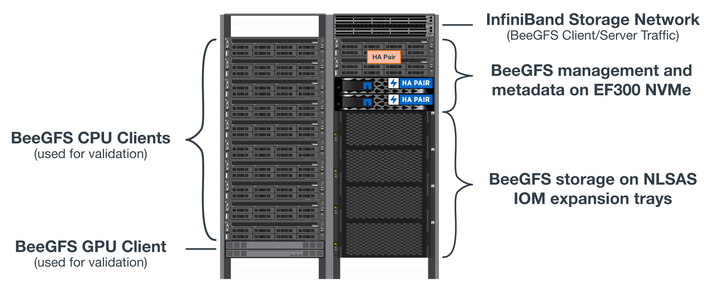
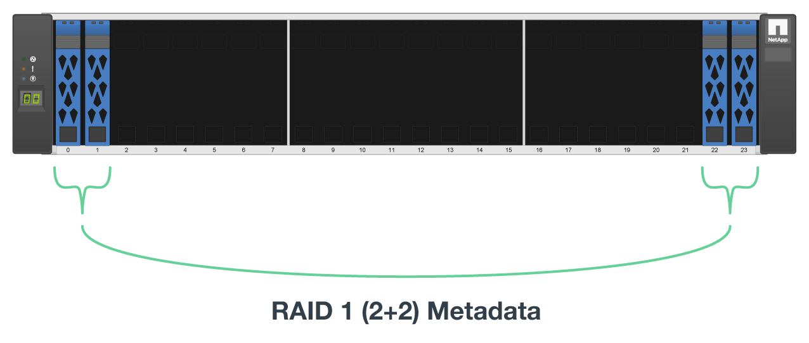

= High capacity building block
:hardbreaks:
:nofooter:
:icons: font
:linkattrs:
:imagesdir: ./media/

[.lead]
The standard BeeGFS solution deployment guide outlines procedures and recommendations for high performance workload requirements. Customers looking to meet high capacity requirements should observe the variations in deployment and recommendations outlined here.

== Controllers
For high capacity building blocks EF600 controllers should be replaced with EF300 controllers, each with a Cascade HIC installed for SAS expansion. Each block node will have a minimal number of NVMe SSDs populated in the array enclosure for BeeGFS metadata storage and will be attached to expansion shelves populated with NL-SAS HDDs for BeeGFS storage volumes. 

File node to Block node configuration remains the same.

== Drive placement
A minimum of 4 NVMe SSD's are required in each block node for BeeGFS metadata storage. These drives should be placed in the outermost slots of the enclosure.

== Expansion trays
The high capacity building block can be sized with 1-7, 60 drive expansion trays per storage array.

For instructions to cable each expansion tray, link:https://docs.netapp.com/us-en/e-series/install-hw-cabling/driveshelf-cable-task.html#cabling-ef300^[refer to EF300 cabling for drive shelves].

