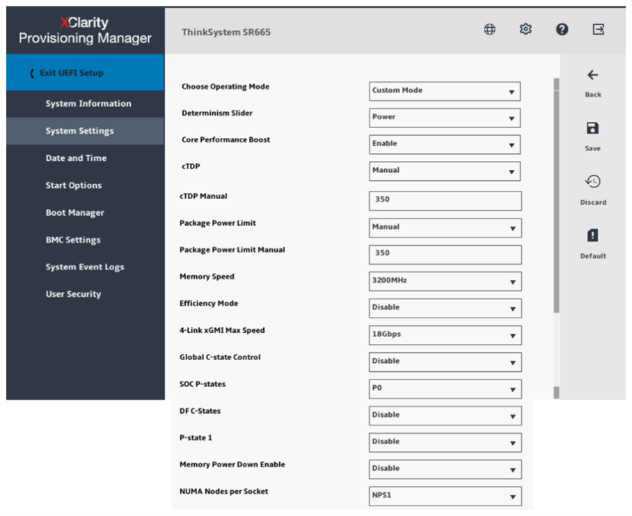
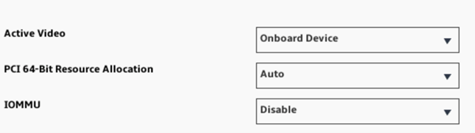
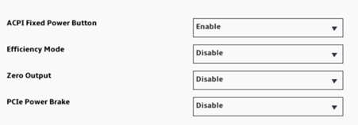
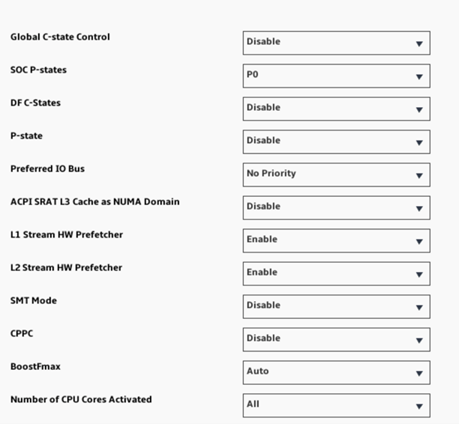

= Performance tuning
:hardbreaks:
:nofooter:
:icons: font
:linkattrs:
:imagesdir: ./media/

//
// This file was created with NDAC Version 2.0 (August 17, 2020)
//
// 2022-05-02 10:33:57.462593
//

[.lead]
Although BeeGFS provides reasonable performance out of the box, NetApp has developed a set of recommended tuning parameters to maximize performance, especially given the capabilities of the underlying E-Series block nodes and to account for any special requirements need to run BeeGFS in a shared-disk HA architecture.

== Tuning parameters
The available tuning parameters can be sorted into three categories:

. Mandatory parameters.
+
 The mandatory parameters affect how BeeGFS services are configured. They also affect how E-Series volumes (block devices) are formatted and mounted by Pacemaker. These E-Series volumes are used as BeeGFS targets.
+
You can tune the mandatory parameters to:

* Optimize initial volume formatting based on the target type (such as management, metadata, or storage), along with the RAID configuration and segment size of the underlying volume.
* Adjust how Pacemaker mounts each volume to ensure that changes are immediately flushed to E-series block nodes. This prevents data loss when file nodes fail with active writes in progress.

. Optional parameters set in the UEFI/BIOS of file nodes.
+
These parameters vary based on the server model used as a file node. The parameters must be manually applied based on the server model in use. For verified file nodes like the Lenovo ThinkSystem SR665 server, use the BIOS/UEFI setup utility to configure the parameters. See <<Performance tuning for the verfied file node>>.

. Optional parameters set in the Linux OS installed on the file node.
+
These parameters can be automatically applied as part of deploying the BeeGFS on NetApp solution using Ansible. The provided defaults are what were used to validate the BeeGFS on NetApp solution and can be further tuned to specific workloads or use cases.

=== Performance tuning for block nodes

Based on the configuration profiles applied to a particular BeeGFS building block, the volume groups configured on the block nodes change slightly. For example, with a 24-drive EF600 block node:

* For the single base building block, including BeeGFS management, metadata, and storage services:
** 1x 2+2 RAID 10 volume group for BeeGFS management and metadata services
** 2x 8+10 RAID 6 volume groups for BeeGFS storage services
* For a BeeGFS metadata + storage building block:
** 1x 2+2 RAID 10 volume group for BeeGFS metadata services
** 2x 8+2 RAID 6 volume groups for BeeGFS storage services
* For BeeGFS storage only building block:
** 2x 10+2 RAID 6 volume groups for BeeGFS storage services

[NOTE]
As BeeGFS needs significantly less storage space for management and metadata versus storage, one option is to use smaller drives for the RAID 10 volume groups. Smaller drives should be populated in the outermost drive slots. For more information, see NVA-1164-DEPLOY-BeeGFS on NetApp deployment guide (xref).

These are all configured by the Ansible-based deployment, along with several other settings generally recommended to optimize performance/behavior including:

* Adjusting the global cache block size to 32KiB and adjusting demand-based cache flushing to 80%.
* Disabling autoload balancing (ensuring controller volume assignments stay as intended).
* Enabling read caching and disabling read- ahead caching.
* Enabling write caching with mirroring and requiring battery backup so that caches persist through failure of a block node controller.
* Specifying the order drives are assigned to volume groups balancing I/O across available drive channels.

== Examples of optional parameters set in the Linux OS
Some examples of optional parameters that can be automatically applied as part of deploying the BeeGFS on NetApp solution using Ansible include the following:

* I/O queues on E-Series block devices.
+
You can configure I/O queues on the E-Series block devices used as BeeGFS targets to:

** Adjust the scheduling algorithm based on the device type (NVMe, HDD, and so on).
** Increase the number of outstanding requests.
** Adjust request sizes.
** Optimize read ahead behavior.

* Virtual memory settings.
+
You can adjust virtual memory settings for optimal sustained streaming performance.

* CPU settings.
+
You can adjust the CPU frequency governor and other CPU configurations for maximum performance.

* Read request size.
+
You can increase the maximum read request size for Mellanox HCAs.

== Performance tuning for the verfied file node
The verfied file node is the Lenovo ThinkSystem SR665 Server. You configure the performance parameters using the BIOS/UEFI setup on the Lenovo ThinkSystem SR665 Server.

Under UEFI Setup > System Settings, adjust the following system settings:

* Operating modes:
** Operating Mode > Custom
** cTDP > Manual
** cTDP Manual > 350
** Package Power Limit > Manual
** Efficiency Mode > Disable
** Global-Cstate-Control > Disable
** SOC P-states > P0
** DF C-States > Disable
** P-State 1 > Disable
** Memory Power Down Enable > Disable
** NUMA Nodes per Socket > NPS1
* Devices and I/O ports:
** IOMMU: Disable
* Power:
** PCIe Power Brake > Disable
* Processors:
** Global C-state Control > Disable
** DF C-States > Disable
** SMT Mode > Disable
** CPPC > Disable

The following screenshot shows the settings for the Lenovo XClarity Provisioning Manager: Operating Modes.

The following screenshot shows the settings for the Lenovo XClarity Provisioning Manager: Devices and I/O Ports.

The following screenshot shows the settings for the Lenovo XClarity Provisioning Manager: Power.

The following screenshot shows the settings for the Lenovo XClarity Provisioning Manager: Processors.

You can also apply the system settings on the Lenovo ThinkSystem SR665 Server using the Redfish API, for example:

....
curl --request PATCH \
  --url https://<BMC_IP_ADDRESS>/redfish/v1/Systems/1/Bios/Pending \
  --user <BMC_USER>:<BMC- PASSWORD> \
  --header 'Content-Type: application/json' \
  --data '{
"Attributes": {
"OperatingModes_ChooseOperatingMode": "CustomMode",
"Processors_cTDP": "Manual",
"Processors_PackagePowerLimit": "Manual",
"Power_EfficiencyMode": "Disable",
"Processors_GlobalC_stateControl": "Disable",
"Processors_SOCP_states": "P0",
"Processors_DFC_States": "Disable",
"Processors_P_state1": "Disable",
"Memory_MemoryPowerDownEnable": "Disable",
"DevicesandIOPorts_IOMMU": "Disable",
"Power_PCIePowerBrake": "Disable",
"Processors_GlobalC_stateControl": "Disable",
"Processors_DFC_States": "Disable",
"Processors_SMTMode": "Disable",
"Processors_CPPC": "Disable",
"Memory_NUMANodesperSocket":"NPS1"
}
}
'
....
