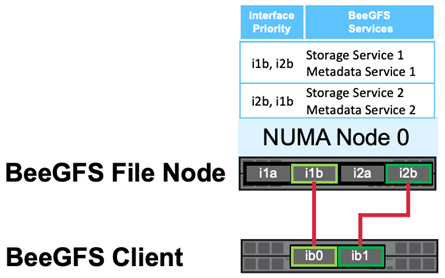
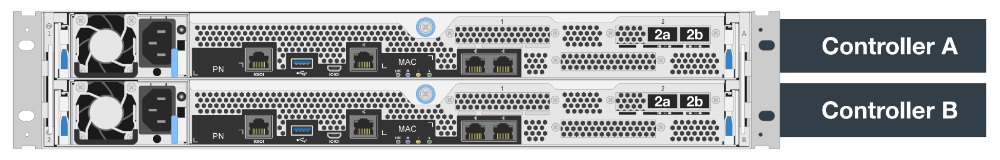
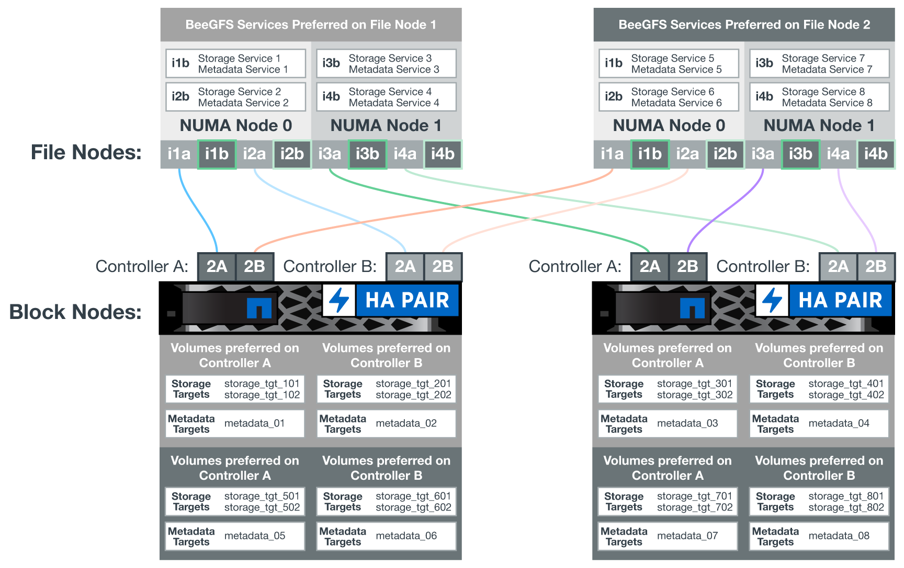
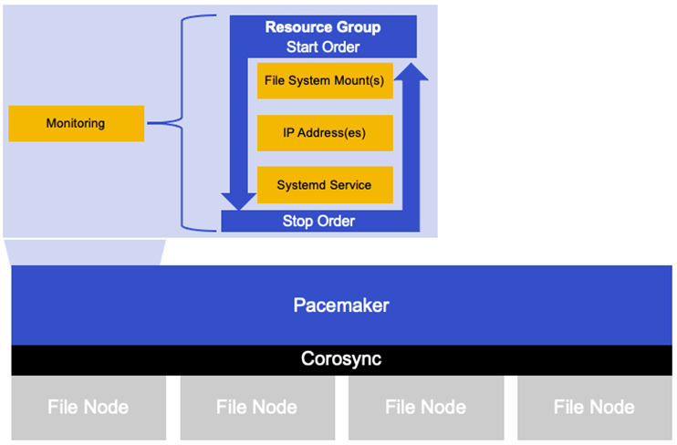

= Software configuration
:hardbreaks:
:nofooter:
:icons: font
:linkattrs:
:imagesdir: ./media/

//
// This file was created with NDAC Version 2.0 (August 17, 2020)
//
// 2022-04-29 10:21:46.087339
//

[.lead]
Learn about the software configuration required to support the BeeGFS on NetApp solution.

Many intentional design choices were made in architecting the software configuration for the BeeGFS on NetApp solution. This topic provides additional details that might be useful to anyone considering or implementing this solution.

== BeeGFS network configuration
The BeeGFS network configuration consists of the following components.

=== Floating IPs
Each BeeGFS server service has its own IP addresses that can move between file nodes depending on where the BeeGFS service is running. This arrangement allows failovers to be opaque from the client’s perspective; the client simply needs to know the IP address to contact a particular BeeGFS service and does not need to worry about what file node is currently running that service.

=== BeeGFS server multi-homing configuration
To increase the density of the solution, each file node has multiple storage interfaces with IPs configured in the same IP subnet.

Additional configuration is required to make sure that this configuration works as expected with the Linux networking stack, because, by default, requests to one interface can be responded to on a different interface if their IPs are in the same subnet. In addition to other drawbacks, this default behavior makes it impossible to properly establish or maintain RDMA connections.

The Ansible-based deployment handles tightening the reverse path (RP) and address resolution protocol (ARP) behavior along with ensuring when floating IPs are started or stopped. Corresponding IP routes and rules are dynamically created to allow the multi- homed network configuration to work properly.

=== BeeGFS client multi-rail configuration
Multi-rail refers to the ability of an application to use multiple independent network “rails” to increase performance.

Although BeeGFS can use RDMA for connectivity, to simplify discovering and establishing RDMA connections, BeeGFS uses IPoIB. Thus, one option to allow BeeGFS clients to use multiple InfiniBand interfaces is to configure each with an IP in a different subnet and then configure the preferred interfaces for half of the BeeGFS server services in each subnet.  In the following diagram,  interfaces highlighted in light green are in one IP subnet (for example, `100.127.0.0/16`) and the dark green interfaces are in another subnet (for example, `100.128.0.0/16`).

The following figure shows the balancing of traffic across multiple BeeGFS client interfaces.

Because each file in BeeGFS is typically striped across multiple storage services, this configuration allows the clients to achieve more throughput than is possible with a single InfiniBand port. For example, the following code sample shows a common file-striping configuration that allows the client to balance traffic across both interfaces:

....
root@ictad21h01:/mnt/beegfs# beegfs-ctl --getentryinfo myfile
Entry type: file
EntryID: 11D-624759A9-65
Metadata node: meta_01_tgt_0101 [ID: 101]
Stripe pattern details:
+ Type: RAID0
+ Chunksize: 1M
+ Number of storage targets: desired: 4; actual: 4
+ Storage targets:
  + 101 @ stor_01_tgt_0101 [ID: 101]
  + 102 @ stor_01_tgt_0101 [ID: 101]
  + 201 @ stor_02_tgt_0201 [ID: 201]
  + 202 @ stor_02_tgt_0201 [ID: 201]
....

It is important to note the use of two IPoIB subnets is a logical distinction, and a single physical InfiniBand subnet (storage network) can still be used if desired.

[NOTE]
Multirail support was added in BeeGFS 7.3.0 to allow the use of multiple IB interfaces in a single IPoIB subnet. This NetApp Verified Architecture was developed prior to the general availability of BeeGFS 7.3.0 and thus demonstrates the use of two IP subnets to use two IB interfaces on the BeeGFS clients. One advantage of the multiple IP subnet approach is eliminating the need to https://doc.beegfs.io/7.3.0/advanced_topics/rdma_support.html[configure multihoming^] on BeeGFS client nodes.

== EF600 block node configuration

Block nodes are comprised of two active/active RAID controllers with shared access to the same set of drives. Typically, each controller owns half the volumes configured on the system but can take over for the other controller as needed.

Multipathing software on the file nodes is responsible for determining the active/optimized path to each volume and automatically moving to the alternate path in the event of a cable, adapter, or controller failure.

The following diagram shows the controller layout in EF600 block nodes.

To facilitate the shared-disk HA solution,  volumes are mapped to both file nodes so that they can take over for each other as needed. The following diagram shows an example of how BeeGFS service and preferred volume ownership is configured for maximum performance. The interface to the left of each BeeGFS service indicates the preferred interface that clients and other services use to contact it.

In the previous example,  clients and server services prefer to communicate with storage service 1 using interface i1b. Storage service 1 uses interface i1a as the preferred path to communicate with its volumes (storage_tgt_101, 102) on controller A of the first block node.  This arrangement allows us to make use of the full bidirectional PCIe bandwidth available to the InfiniBand adapter and achieve better performance from a dual- port HDR InfiniBand adapter than would otherwise be possible with PCIe 4.0.

== File node configuration
Learn about the file node configuration required to support the BeeGFS on NetApp solution.

=== High availability clustering

Typically, when you start a BeeGFS service (with or without HA), a few resources must be in place:

* IP addresses where the service is reachable at, typically configured by Network Manager.
* Underlying file systems used as the targets for BeeGFS to store data.  These are typically defined in `/etc/fstab` and mounted by Systemd.
* A Systemd service responsible for starting BeeGFS processes once the other resources are ready.Without additional software,  these resources are only able to start on a single node. Therefore, if the node goes offline for any reason, a portion of the BeeGFS filesystem is inaccessible.

To facilitate failover of BeeGFS services between multiple nodes, the file nodes in the NetApp BeeGFS building blocks are configured into an HA cluster.  This cluster is built on two widely used Linux HA projects, https://access.redhat.com/documentation/en-us/red_hat_enterprise_linux/8/html/configuring_and_managing_high_availability_clusters/assembly_overview-of-high-availability-configuring-and-managing-high-availability-clusters[Corosync for cluster membership and Pacemaker for cluster resource management^]. NetApp has also authored and extended several open cluster framework (OCF) resource agents that implement functionality that allows the cluster to intelligently start and monitor these BeeGFS resources.

When BeeGFS is running in an HA cluster, all BeeGFS services and underlying resources are managed by Pacemaker. Each BeeGFS service and the resources it depends on are configured into a resource group, which ensures resources are started and stopped in the correct order and collocated on the same node. For each BeeGFS resource group,  Pacemaker also runs a custom BeeGFS monitoring resource that is responsible for detecting failure conditions and intelligently triggering failovers when a BeeGFS service is no longer accessible on a particular node.

The following figure shows the Pacemaker-controlled BeeGFS services and dependencies.

[NOTE]
So that multiple BeeGFS services of the same type are started on the same node, Pacemaker is configured to start BeeGFS services using the https://doc.beegfs.io/latest/advanced_topics/multimode.html[Multi Mode^] configuration method.

Because BeeGFS services must be able to start on multiple nodes, the configuration file for each service (normally located at `/etc/beegfs`) is stored on one of the E-Series volumes used as the BeeGFS target for that service. This makes the configuration along with the data for a particular BeeGFS service accessible to all nodes that might need to run the service.

....
# tree stor_01_tgt_0101/ -L 2
stor_01_tgt_0101/
├── data
│   ├── benchmark
│   ├── buddymir
│   ├── chunks
│   ├── format.conf
│   ├── lock.pid
│   ├── nodeID
│   ├── nodeNumID
│   ├── originalNodeID
│   ├── targetID
│   └── targetNumID
└── storage_config
    ├── beegfs-storage.conf
    ├── connInterfacesFile.conf
    └── connNetFilterFile.conf
....

Because multiple nodes can start each BeeGFS service, Pacemaker must make sure each service and dependent resources are only running on one node at a time.  For example, if two nodes try to start the same BeeGFS service,  there is a risk of data corruption if they both try to write to the same files on the underlying target. To avoid this scenario,  Pacemaker relies on Corosync to reliably keep the state of the overall cluster in sync across all nodes and establish quorum.

If a failure occurs in the cluster,  Pacemaker reacts and restarts BeeGFS resources on another node.  In some scenarios,  Pacemaker might not be able to communicate with the original faulty node to confirm the resources are stopped. To verify that the node is down before restarting BeeGFS resources elsewhere,  Pacemaker fences off the faulty node, ideally by removing power. Many open-source fencing agents are available that enable Pacemaker to fence a node with a power distribution unit (PDU) or by using the server baseboard management controller (BMC) with APIs such as Redfish.
