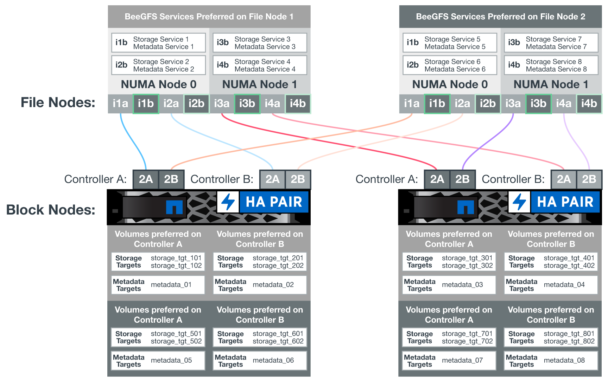

= Software configuration
:hardbreaks:
:nofooter:
:icons: font
:linkattrs:
:imagesdir: ./media/

[.lead]
The software configuration for BeeGFS on NetApp includes BeeGFS network components, EF600 block nodes, BeeGFS file nodes, resource groups, and BeeGFS services.

== BeeGFS network configuration
The BeeGFS network configuration consists of the following components.

* *Floating IPs*
Floating IPs are a kind of virtual IP address that can be dynamically routed to any server in the same network. Multiple servers can own the same Floating IP address, but it can only be active on one server at any given time.
+
Each BeeGFS server service has its own IP address that can move between file nodes depending on the run location of the BeeGFS server service. This floating IP configuration allows each service to fail over independently to the other file node. The client simply needs to know the IP address for a particular BeeGFS service; it does not need to know which file node is currently running that service.

* *BeeGFS server multi-homing configuration*
To increase the density of the solution, each file node has multiple storage interfaces with IPs configured in the same IP subnet.
+
Additional configuration is required to make sure that this configuration works as expected with the Linux networking stack, because by default, requests to one interface can be responded to on a different interface if their IPs are in the same subnet. In addition to other drawbacks, this default behavior makes it impossible to properly establish or maintain RDMA connections.
+
The Ansible-based deployment handles tightening of the reverse path (RP) and address resolution protocol (ARP) behavior, along with ensuring when floating IPs are started and stopped; corresponding IP routes and rules are dynamically created to allow the multihomed network configuration to work properly.

* *BeeGFS client multi-rail configuration*
_Multi-rail_ refers to the ability of an application to use multiple independent network connections, or “rails”, to increase performance.
+
BeeGFS implements multi-rail support to allow the use of multiple IB interfaces in a single IPoIB subnet. This capability enables features such as dynamic load balancing across RDMA NICs, optimizing the use of network resources. It also integrates with NVIDIA GPUDirect Storage (GDS), which offers increased system bandwidth and decreases latency and utilization on the client's CPU.
+
This documentation provides instructions for single IPoIB subnet configurations. Dual IPoIB subnet configurations are supported but do not provide the same advantages as single subnet configurations.
+
The following figure shows the balancing of traffic across multiple BeeGFS client interfaces.
+
image:../media/beegfs-design-image8.png[]
+
Because each file in BeeGFS is typically striped across multiple storage services, the multi-rail configuration allows the client to achieve more throughput than is possible with a single InfiniBand port. For example, the following code sample shows a common file-striping configuration that allows the client to balance traffic across both interfaces:
+
....
root@beegfs01:/mnt/beegfs# beegfs-ctl --getentryinfo myfile
Entry type: file
EntryID: 11D-624759A9-65
Metadata node: meta_01_tgt_0101 [ID: 101]
Stripe pattern details:
+ Type: RAID0
+ Chunksize: 1M
+ Number of storage targets: desired: 4; actual: 4
+ Storage targets:
  + 101 @ stor_01_tgt_0101 [ID: 101]
  + 102 @ stor_01_tgt_0101 [ID: 101]
  + 201 @ stor_02_tgt_0201 [ID: 201]
  + 202 @ stor_02_tgt_0201 [ID: 201]
....

== EF600 block node configuration

Block nodes are comprised of two active/active RAID controllers with shared access to the same set of drives. Typically, each controller owns half the volumes configured on the system, but can take over for the other controller as needed.

Multipathing software on the file nodes determines the active and optimized path to each volume and automatically moves to the alternate path in the event of a cable, adapter, or controller failure.

The following diagram shows the controller layout in EF600 block nodes.

To facilitate the shared-disk HA solution, volumes are mapped to both file nodes so that they can take over for each other as needed. The following diagram shows an example of how the BeeGFS service and preferred volume ownership is configured for maximum performance. The interface to the left of each BeeGFS service indicates the preferred interface that the clients and other services use to contact it.

In the previous example, clients and server services prefer to communicate with storage service 1 using interface i1b. Storage service 1 uses interface i1a as the preferred path to communicate with its volumes (storage_tgt_101, 102) on controller A of the first block node. This configuration makes use of the full bidirectional PCIe bandwidth available to the InfiniBand adapter and achieves better performance from a dual-port HDR InfiniBand adapter than would otherwise be possible with PCIe 4.0.

== BeeGFS file node configuration
The BeeGFS file nodes are configured into a High-Availability (HA) cluster to facilitate failover of BeeGFS services between multiple file nodes.

The HA cluster design is based on two widely used Linux HA projects: Corosync for cluster membership and Pacemaker for cluster resource management. For more information, see https://docs.redhat.com/en/documentation/red_hat_enterprise_linux/9/html/configuring_and_managing_high_availability_clusters/assembly_overview-of-high-availability-configuring-and-managing-high-availability-clusters[Red Hat training for high-availability add-ons^].

NetApp authored and extended several open cluster framework (OCF) resource agents to allow the cluster to intelligently start and monitor the BeeGFS resources.

== BeeGFS HA clusters

Typically, when you start a BeeGFS service (with or without HA), a few resources must be in place:

* IP addresses where the service is reachable, typically configured by Network Manager.
* Underlying file systems used as the targets for BeeGFS to store data.
+
These are typically defined in `/etc/fstab` and mounted by Systemd.
* A Systemd service responsible for starting BeeGFS processes when the other resources are ready.
+
Without additional software, these resources start only on a single file node. Therefore, if the file node goes offline, a portion of the BeeGFS file system is inaccessible.

Because multiple nodes can start each BeeGFS service, Pacemaker must make sure each service and dependent resources are only running on one node at a time. For example, if two nodes try to start the same BeeGFS service, there is a risk of data corruption if they both try to write to the same files on the underlying target. To avoid this scenario, Pacemaker relies on Corosync to reliably keep the state of the overall cluster in sync across all nodes and establish quorum.

If a failure occurs in the cluster, Pacemaker reacts and restarts BeeGFS resources on another node.  In some scenarios,  Pacemaker might not be able to communicate with the original faulty node to confirm the resources are stopped. To verify that the node is down before restarting BeeGFS resources elsewhere,  Pacemaker fences off the faulty node, ideally by removing power.

Many open-source fencing agents are available that enable Pacemaker to fence a node with a power distribution unit (PDU) or by using the server baseboard management controller (BMC) with APIs such as Redfish.

When BeeGFS is running in an HA cluster, all BeeGFS services and underlying resources are managed by Pacemaker in resource groups. Each BeeGFS service and the resources it depends on, are configured into a resource group, which ensures resources are started and stopped in the correct order and collocated on the same node.

For each BeeGFS resource group, Pacemaker runs a custom BeeGFS monitoring resource that is responsible for detecting failure conditions and intelligently triggering failovers when a BeeGFS service is no longer accessible on a particular node.

The following figure shows the Pacemaker-controlled BeeGFS services and dependencies.

image:../media/beegfs-design-image11.png[]

[NOTE]
So that multiple BeeGFS services of the same type are started on the same node, Pacemaker is configured to start BeeGFS services using the Multi Mode configuration method. For more information, see the https://doc.beegfs.io/latest/advanced_topics/multimode.html[BeeGFS documentation on Multi Mode^].

Because BeeGFS services must be able to start on multiple nodes, the configuration file for each service (normally located at `/etc/beegfs`) is stored on one of the E-Series volumes used as the BeeGFS target for that service. This makes the configuration along with the data for a particular BeeGFS service accessible to all nodes that might need to run the service.

....
# tree stor_01_tgt_0101/ -L 2
stor_01_tgt_0101/
├── data
│   ├── benchmark
│   ├── buddymir
│   ├── chunks
│   ├── format.conf
│   ├── lock.pid
│   ├── nodeID
│   ├── nodeNumID
│   ├── originalNodeID
│   ├── targetID
│   └── targetNumID
└── storage_config
    ├── beegfs-storage.conf
    ├── connInterfacesFile.conf
    └── connNetFilterFile.conf
....
